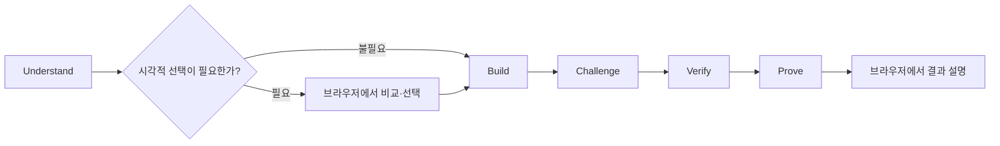
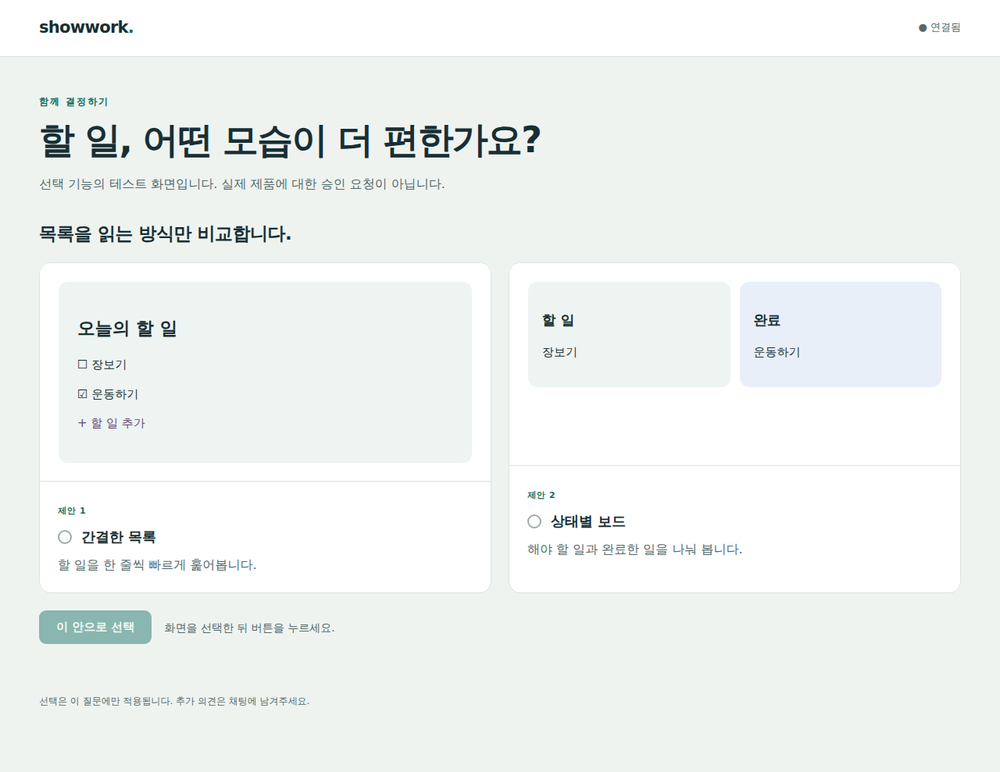

# Showwork

**Make coding agents show their work.**

*Plan visually. Build autonomously. Verify with evidence.*

Showwork는 AI 코딩 에이전트의 계획과 변경을 사람이 이해하고, 중요한 결정을 내리고, 실제 증거로 결과를 확인하도록 돕는 Claude Code·Codex 플러그인입니다.



## 동작 방식

“구독 취소 기능을 추가해줘”라고 요청하면 코드를 살펴보고 현재 흐름과 변경 후 동작을 보여줍니다. 취소를 즉시 적용할지 기간 말에 적용할지처럼 결과를 바꾸는 결정이 빠져 있다면 선택지를 설명합니다. 이미 정한 사항과 일상적인 구현 선택은 다시 승인받지 않습니다.

단순하고 명확한 작업은 바로 진행합니다. UI 선택을 받아야 한다면 브라우저에서 실제 비교안을 보여주고 선택을 기록합니다. 모든 화면 작업에 컨펌 단계를 만들지는 않습니다.

구현 후에는 실제 실패 가능성을 검토하고, 관련 테스트와 실행 결과를 요구사항에 연결합니다. 마지막에는 브라우저에서 실제 결과 화면, 동작 흐름, 변경 전후 비교 등 이해에 필요한 시각 자료와 검증 결과를 함께 설명합니다. 확인하지 못한 부분은 미검증으로 남깁니다. 완료 설명은 추가 승인을 요구하지 않습니다.

네 가지 원칙을 따릅니다.

- **보여줄 수 있는 것을 상상하게 하지 않는다.** 화면, 동작 예시, 다이어그램 중 이해에 필요한 표현을 사용합니다.
- **사람이 결정해야 할 때만 묻는다.** 중요한 제품·사업·설계 선택을 드러내고, 반복적인 승인 절차를 만들지 않습니다.
- **구현을 맡겨도 기술적 이해는 유지한다.** 변경 이유와 영향, 중요한 판단을 설명합니다.
- **증거 없이 완료라고 하지 않는다.** 계획, 테스트 성공, 실제 동작, 미검증 사항을 구분합니다.

## 시작하기

별도 서비스나 API 키가 필요하지 않습니다. 사용하는 코딩 에이전트의 기존 인증과 도구를 사용합니다. Python 3.11 이상이 필요합니다.

**Codex는 대상 프로젝트 폴더에서 한 줄로 설치합니다.** Node.js 20 이상(npm/npx 포함)과 Git이 필요합니다.

```bash
npx --yes github:cwsbrian/showwork
```

설치 후 해당 프로젝트에서 **새 Codex 채팅**을 열고 평소처럼 요청하세요. 현재 폴더의 `.agents/skills`와 프로젝트 지침에 설치되며 기존 사용자 내용을 보존합니다. 다른 폴더에 설치하려면 `npx --yes github:cwsbrian/showwork install --target /absolute/path/to/your-project`를 사용하세요.

이 명령은 GitHub에서 직접 가져옵니다. npm 레지스트리에는 아직 게시하지 않았으므로 `npx showwork`는 사용하지 마세요. Claude Code 플러그인은 아래 방법으로 불러옵니다.

### Claude Code

먼저 저장소를 내려받고, 경로를 실제 위치로 바꾸세요.

```bash
git clone https://github.com/cwsbrian/showwork.git
```

```bash
cd /absolute/path/to/your-project
claude --plugin-dir /absolute/path/to/showwork
```

세션에서 일반 요청을 입력합니다. Python 3.11 이상이 필요합니다. 요청 훅이 자동 판단 지침을 전달합니다.

```text
구독 취소 기능을 추가해줘
```

특정 모드를 직접 지정할 수도 있습니다.

```text
/showwork:run 구독 취소 기능을 추가해줘
/showwork:plan 구독 취소 기능의 동작과 구현 계획을 보여줘
/showwork:review 현재 변경사항을 리뷰해줘
/showwork:verify 구현한 구독 취소 기능을 검증해줘
```

### Codex

npx 대신 저장소를 내려받아 Python 설치기를 직접 실행할 수도 있습니다.

```bash
python3 /absolute/path/to/showwork/scripts/install_codex.py --target /absolute/path/to/your-project
```

해당 프로젝트에서 **새 Codex 채팅**을 열고 일반 요청을 입력합니다.

```text
구독 취소 기능을 추가해줘
```

설치기는 네 스킬과 함께 프로젝트 `AGENTS.md`에 자동 판단 지침을 추가합니다. 내용이 있는 `AGENTS.override.md`가 있으면 실제로 읽히는 그 파일을 사용합니다. 이제 `$showwork`를 붙이지 않아도 작업 규모와 요청 범위에 맞는 경로를 선택하도록 지시됩니다.

특정 모드를 직접 지정할 수도 있습니다.

```text
$showwork 구독 취소 기능을 추가해줘
$showwork-plan 구독 취소 기능의 동작과 구현 계획을 보여줘
$showwork-review 현재 변경사항을 리뷰해줘
$showwork-verify 구현한 구독 취소 기능을 검증해줘
```

설치기는 `.agents/skills`에 네 스킬을 복사합니다. 같은 내용은 그대로 두고, 기존 스킬 내용이 다르면 덮어쓰지 않고 멈춥니다. 프로젝트 지침에서는 Showwork가 관리하는 블록만 갱신하며 다른 내용을 보존합니다. 네이티브 플러그인 매니페스트도 포함되어 있습니다. 두 설치 방식의 차이와 업데이트 방법은 [설치 안내](docs/installation.md)를 참고하세요.

## 요청에 맞는 모드

| 모드 | 결과 |
| --- | --- |
| 전체 실행 | 조사 → 필요할 때 브라우저 선택 → 구현 → 리뷰 → 검증 → 브라우저 결과 설명 |
| 계획 | 동작 예시, 중요한 결정, 구현 순서, 관찰 가능한 성공 조건 |
| 리뷰 | 전체 변경 범위에서 찾은 재현 가능한 결함과 검증 공백 |
| 검증 | 요구사항별로 입증된 동작, 실패, 미검증 사항 |

계획·리뷰·검증만 요청하면 해당 범위에서 작업합니다. 일반 개발 요청에는 자동 적용되도록 연결되어 있고, 관련 없는 대화에는 작업 절차를 만들지 않습니다. 작업 시작 시 선택한 경로를 짧게 알려줍니다. 새 앱이라도 단순하고 명확하면 미리보기나 승인 질문 없이 진행할 수 있습니다. 시각적 선택이 필요할 때는 문자 그림 대신 브라우저 비교안을 사용합니다. 모델이 지침을 따르는지를 강제로 증명하는 정책 엔진은 아닙니다.

## 브라우저에서 함께 보기



- **선택 화면:** 렌더링된 UI·다이어그램을 나란히 비교하고, 클릭 또는 키보드로 선택해 기록합니다. 화면이 바뀌면 이전 선택은 새 질문에 적용되지 않습니다.
- **완료 화면:** 실제 캡처와 설명용 시각화를 구분해 보여주고, 확인됨·실패·미검증 항목에 근거를 붙입니다. 승인 버튼은 없습니다.

브라우저 도구는 `showwork` 스킬 안에 있어 Codex 프로젝트 설치에도 함께 복사됩니다. Python 표준 라이브러리만 사용하며 화면은 자동 갱신됩니다. 사용법과 페이지 형식은 [브라우저 안내](skills/showwork/references/companion.md)를 참고하세요. 브라우저 선택은 기록되지만 대기 중인 에이전트를 자동으로 깨우지는 않으므로, 필요한 경우 채팅에서 이어가세요.

## 검증 증거 남기기

선택 기능인 Python 도구가 테스트 출력·API 결과·스크린샷 등 기존 자료를 요구사항별로 기록합니다. 외부 라이브러리는 필요하지 않습니다.

```bash
python3 /absolute/path/to/showwork/scripts/showwork.py init cancellation \
  --title "구독 취소" \
  --criterion "기간 말까지 접근을 유지하고 다음 결제를 중단한다"
```

실제 검사 명령은 `check ... -- <명령>`으로 기록하고, 직접 확인한 파일은 `attach`로 연결합니다. 결과는 대상 프로젝트의 `.showwork/runs/`에 저장됩니다. [증거 도구 사용법](docs/evidence.md)에 실행 예시가 있습니다.

기록 도구의 성공은 **증거가 수집됐다는 뜻**입니다. 요구사항을 충족하는지와 현재 코드에도 유효한지는 에이전트가 검토해야 합니다. 스킬은 이 도구 없이도 사용할 수 있습니다.

## v0.2 범위와 검증

이 버전은 공통 스킬, 두 런타임의 자동 적용 연결, 플러그인 형식, 로컬 설치기, 증거 기록 도구, 브라우저 companion을 제공합니다. Claude의 요청 훅은 지침을 전달하며 도구 실행을 차단하지 않습니다. Companion은 시각적 자료를 보여주는 도구입니다. 실제 앱의 브라우저 조작·스크린샷 수집·시뮬레이터 검증은 환경에 있는 도구로 수행하며, 입증하지 못한 요구사항은 미검증으로 보고합니다.

```bash
python3 -m unittest discover -s tests -v
npm test
claude plugin validate . --strict
```

[검증 기록](docs/validation.md)에는 실제 확인한 범위와 한계를, [동작 예시](examples/subscription-cancellation.md)에는 예상 사용자 경험을 적었습니다.

```text
.codex-plugin/plugin.json    Codex 매니페스트
.claude-plugin/plugin.json   Claude Code 매니페스트
commands/                   Claude의 짧은 명령
hooks/hooks.json            Claude 요청별 자동 적용
instructions/automatic.md   두 환경의 공통 자동 판단 지침
skills/                     두 환경이 공유하는 네 스킬
skills/showwork/scripts/     로컬 브라우저 companion
skills/showwork/assets/      선택·완료 설명 화면
scripts/install_codex.py     프로젝트 스킬·지침 설치기
scripts/cli.cjs              npx 설치 진입점
scripts/showwork.py          선택형 증거 기록 도구
tests/                      설치와 증거 처리 회귀 테스트
```
