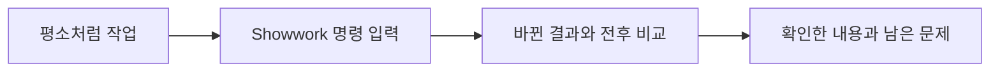

# Showwork

**작업이 끝난 뒤, 무엇이 달라졌는지 쉽게 보여줍니다.**

평소에는 켜지지 않습니다. 필요한 때 명령어를 입력하면 바뀐 화면과 동작, 확인한 내용, 남은 문제를 브라우저에서 볼 수 있어요.



## 설치와 업데이트

```bash
npx --yes github:cwsbrian/showwork
```

한 번 실행하면 Codex와 Claude Code에 사용자 단위로 설치합니다. 같은 명령을 다시 실행하면 최신 버전으로 바뀝니다. Node.js 20 이상, Git, Python 3.11 이상이 필요합니다. 별도 API 키는 필요하지 않습니다.

설치 뒤 **새 세션**을 여세요. 일반 작업 요청에는 Showwork가 켜지지 않습니다.

## 작업이 끝난 뒤 사용하기

| 설치 방식 | 결과 설명 명령 |
| --- | --- |
| Codex 사용자 설치 | `$showwork 방금 작업한 결과를 보여줘` |
| Claude 사용자 설치 | `/showwork 방금 작업한 결과를 보여줘` |
| Claude 플러그인 | `/showwork:run 방금 작업한 결과를 보여줘` |

명령만 입력해도 현재 작업과 변경 내용을 확인합니다. 어떤 결과인지 알 수 없으면 대상만 물어봅니다. 결과 설명 요청만으로 코드를 다시 만들거나 고치지는 않습니다. 명령과 함께 새 구현을 명시한 경우에는 구현과 검사를 마친 뒤 결과를 보여줍니다.

설명은 다음 내용에 집중합니다.

- 무엇이 바뀌었는지, 전과 비교해 무엇이 좋아졌는지
- 화면과 기능이 지금 어떻게 움직이는지
- 실제로 확인한 것과 아직 남은 문제

긴 작업 일지나 매 단계의 승인 절차를 만들지 않습니다. 필요한 기술 자료는 ‘자세히 보기’에 둡니다.

## 다른 명령

| 용도 | Codex | Claude 사용자 설치 | Claude 플러그인 |
| --- | --- | --- | --- |
| 계획만 세우기 | `$showwork-plan` | `/showwork-plan` | `/showwork:plan` |
| 변경 검토하기 | `$showwork-review` | `/showwork-review` | `/showwork:review` |
| 잘 되는지 확인하기 | `$showwork-verify` | `/showwork-verify` | `/showwork:verify` |
| 반례 중심 검토와 시각 보고서 | `$showwork-adverial-review` | `/showwork-adverial-review` | `/showwork:adverial-review` |

모두 직접 명령을 입력했을 때만 사용합니다. 일반 요청이나 Showwork에 대한 대화는 실행 명령이 아닙니다. 한 작업에서 켰다고 다음의 다른 작업까지 계속 켜지지는 않습니다.

## 설치 위치와 이전 버전 갱신

| 도구 | 스킬 | 명령 전용 안내 |
| --- | --- | --- |
| Codex | `~/.agents/skills/showwork*` | `~/.codex/AGENTS.md` (활성 override 우선) |
| Claude Code | `~/.claude/skills/showwork*` | `~/.claude/CLAUDE.md` |

`CODEX_HOME`과 `CLAUDE_CONFIG_DIR`을 존중합니다. 이전 버전의 자동 적용 지침은 관리 블록 안에서 명령 전용 지침으로 교체합니다. 블록 밖의 사용자 지침과 다른 스킬은 보존합니다. Codex 자동 선택과 Claude 자동 호출을 각각 끄고, 플러그인의 요청별 자동 실행 연결도 제거했습니다.

이전에 프로젝트에 따로 설치했다면 해당 프로젝트도 `npx --yes github:cwsbrian/showwork --target /absolute/project`로 갱신하세요. 다른 프로젝트의 옛 설치는 자동으로 찾아 수정하지 않습니다. 같은 스킬의 사용자 설치와 플러그인 중복 활성화는 피하세요.

한 도구만 설치하려면 `--runtime codex` 또는 `--runtime claude`를 붙이세요. npm 레지스트리에 게시하지 않았으므로 `npx showwork` 대신 위 GitHub 명령을 사용하세요. [설치·복구 안내](docs/installation.md)

Claude 플러그인으로 직접 쓸 때는 저장소를 내려받은 뒤 실행합니다.

```bash
claude --plugin-dir /absolute/path/to/showwork
```

Python 설치기를 직접 써도 됩니다. 이때는 먼저 저장소를 최신 버전으로 갱신하세요.

```bash
python3 /absolute/path/to/showwork/scripts/install_codex.py --user
```

## 시각적 Adversarial Review

명령 이름은 요청한 표기인 `adverial-review`를 사용합니다. 설치 방식에 맞춰 호출하세요.

| 설치 방식 | 호출 예시 |
| --- | --- |
| npx 사용자 설치 · Claude Code | `/showwork-adverial-review 현재 변경사항을 리뷰해줘` |
| npx 사용자 설치 · Codex | `$showwork-adverial-review 현재 변경사항을 리뷰해줘` |
| Claude 플러그인 | `/showwork:adverial-review 현재 변경사항을 리뷰해줘` |

변경 범위와 실제 호출 경로를 읽고, 권한·경계값·중복 동작·부분 실패 등 코드에 맞는 반례를 검토합니다. 결과는 심각도, 소스 위치, 재현 조건, 기대/실제 동작, 근거를 연결한 localhost 보고서로 보여줍니다. 수정은 별도 요청이 있을 때만 적용합니다.

모바일 앱이면 대상 iOS Simulator/Android Emulator를 띄우고 **리뷰 대상 빌드 설치 → 앱 실행 → 관련 화면 조작 → 실제 스크린샷 첨부**를 수행합니다. 기기·OS·빌드·조작 내용과 캡처의 출처를 함께 표시합니다. 시뮬레이터·SDK·빌드 설정·조작 도구가 없으면 해당 단계를 미검증으로 남기고 가능한 코드 리뷰를 계속합니다. 웹의 모바일 뷰포트나 화면 목업은 네이티브 앱 캡처를 대체하지 않습니다.

## 브라우저에서 함께 보기


- **선택 화면:** 렌더링된 UI·다이어그램을 나란히 비교하고, 클릭 또는 키보드로 선택해 기록합니다. 화면이 바뀌면 이전 선택은 새 질문에 적용되지 않습니다.
- **완료 화면:** 전체 너비의 자료와 목차로 변경 내용을 설명합니다. 라우터 변경은 분기·응답이 연결된 흐름도, DB 변경은 PK/FK·관계 수를 연결한 전후 ERD를 먼저 보여줍니다. 경로 표·스키마 비교·마이그레이션/백필/롤백 정보는 보조 자료로 두고, 구조 변경은 컴포넌트와 데이터 흐름도를 포함합니다. 해당 작업에서 바뀐 영역만 다룹니다.
- **근거:** 소스 위치·변경 이유·실제 검사 결과·미검증 사항을 함께 보여줍니다. 설명용 다이어그램과 실제 관찰, 작성된 마이그레이션과 실행된 마이그레이션을 구분합니다. 승인 버튼은 없습니다.

설명은 초등학교 3학년도 이해할 수 있는 쉬운 말로 짧게 합니다. 무엇이 바뀌었고 왜 좋은지 먼저 보여줍니다. 어려운 말은 바로 풀어서 설명하고, 코드와 명령어는 **자세히 보기**에 둡니다. 중요한 문제와 아직 확인하지 못한 내용은 숨기지 않습니다.

보고서 작성만 Codex Luna / Claude Haiku 서브에이전트에 맡기는 것을 기본으로 합니다. 현재 모델이 앱·시뮬레이터 조작, 캡처, 리뷰 판정과 최종 화면 확인을 담당합니다. 모델 선택이 불가능하면 현재 모델이 작성하고 대체 사실을 표시합니다. Terra·Sonnet 등 명시한 선호는 우선하며, 사용자 전역 모델 설정은 변경하지 않습니다. 이는 에이전트 실행 지침이며 서버가 모델 호출을 강제하지는 않습니다. 긴 캡처는 **원본 이미지 열기**로 새 탭에서 확대할 수 있습니다.

보고서·캡처·검사 기록은 프로젝트에 만들지 않고 **`/tmp`**에 저장합니다. 프로젝트마다 다른 임시 폴더를 씁니다. 컴퓨터가 임시 파일을 정리하면 사라질 수 있어요. Windows에서는 운영체제의 임시 폴더를 씁니다.

브라우저 도구는 `showwork` 스킬 안에 있어 두 도구의 사용자·프로젝트 설치에 함께 복사됩니다. Python 표준 라이브러리만 사용하며 화면은 자동 갱신됩니다. 사용법과 페이지 형식은 [브라우저 안내](skills/showwork/references/companion.md)를 참고하세요. 브라우저 선택은 기록되지만 대기 중인 에이전트를 자동으로 깨우지는 않으므로, 필요한 경우 채팅에서 이어가세요.

## 검증 증거 남기기

선택 기능인 Python 도구가 테스트 출력·API 결과·스크린샷 등 기존 자료를 요구사항별로 기록합니다. 외부 라이브러리는 필요하지 않습니다.

```bash
python3 /absolute/path/to/showwork/scripts/showwork.py init cancellation \
  --title "구독 취소" \
  --criterion "기간 말까지 접근을 유지하고 다음 결제를 중단한다"
```

실제 검사 명령은 `check ... -- <명령>`으로 기록하고, 직접 확인한 파일은 `attach`로 연결합니다. 결과는 `/tmp` 아래에 저장됩니다. `init`이 알려주는 경로로 다음 명령을 실행하세요. [증거 도구 사용법](docs/evidence.md)에 실행 예시가 있습니다.

기록 도구의 성공은 **증거가 수집됐다는 뜻**입니다. 요구사항을 충족하는지와 현재 코드에도 유효한지는 에이전트가 검토해야 합니다. 스킬은 이 도구 없이도 사용할 수 있습니다.

## v0.5 범위와 검증

이 버전은 공통 스킬, 두 런타임의 사용자 설치·업데이트, 플러그인 형식, 증거 기록 도구, 변경 영역별 상세 브라우저 설명을 제공합니다. 모든 실행 방식은 명령 전용이며 일반 요청에 끼어들지 않습니다. Companion은 시각적 자료를 보여주는 도구입니다. 실제 앱의 브라우저 조작·스크린샷 수집·시뮬레이터 검증은 환경에 있는 도구로 수행하며, 입증하지 못한 요구사항은 미검증으로 보고합니다.

```bash
python3 -m unittest discover -s tests -v
npm test
claude plugin validate . --strict
```

[검증 기록](docs/validation.md)에는 실제 확인한 범위와 한계를, [동작 예시](examples/subscription-cancellation.md)에는 예상 사용자 경험을 적었습니다.

```text
.codex-plugin/plugin.json    Codex 매니페스트
.claude-plugin/plugin.json   Claude Code 매니페스트
commands/                   Claude의 짧은 명령
instructions/manual.md      두 환경의 공통 명령 전용 안내
skills/                     두 환경이 공유하는 다섯 스킬
skills/showwork/scripts/     로컬 브라우저 companion
skills/showwork/assets/      선택·완료 설명 화면
scripts/install_codex.py     사용자·프로젝트 스킬·지침 설치기
scripts/cli.cjs              npx 설치 진입점
scripts/showwork.py          선택형 증거 기록 도구
tests/                      설치와 증거 처리 회귀 테스트
```
