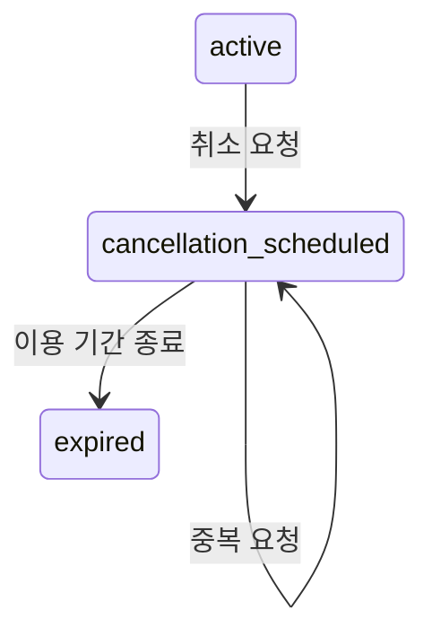

# 예상 동작: 구독 취소

아래는 Showwork의 사용자 경험을 설명하는 **가상 예시**입니다. 실제 앱 구현이나 테스트 결과가 아닙니다.

사용자:

> $showwork 구독 취소 기능을 추가해줘.

에이전트는 구독 상태와 결제 흐름을 읽고, 필요한 경우 다음 결정을 설명합니다.

> 현재는 활성 구독과 만료된 구독을 구분합니다. 취소 요청을 받았을 때 남은 기간 동안 이용을 유지하고 다음 결제를 중단하는 방식을 제안합니다. 즉시 접근을 종료하는 방식은 환불 정책도 함께 정해야 합니다.

정책이 아직 정해지지 않았다면 사용자가 결정해야 합니다. 이미 “기간 말에 종료”라고 정했다면 같은 질문을 반복하지 않습니다. 질문에 의존하지 않는 기존 코드 조사나 화면 구조 확인은 계속합니다.

계획 단계에서 제안하는 상태 흐름:

UI 선택이 필요하다면 브라우저에서 취소 확인 화면의 비교안을 보여줍니다. 이미 디자인과 동작이 명확하면 바로 구현합니다. 제안용 화면과 실제 구현 결과를 구분합니다.

검증 전에 정리하는 성공 조건의 예시:

| 조건 | 적절한 증거 |
| --- | --- |
| 취소 후 남은 기간 동안 접근 유지 | 시간 조건을 포함한 권한 검사 또는 해당 경계의 실행 테스트 |
| 다음 결제 예약 중단 | 결제 제공자의 테스트 환경 응답과 로컬 상태 확인 |
| 중복 취소 요청에도 상태 일관성 유지 | 같은 요청을 반복한 실행 결과 |
| 이용 종료일을 사용자가 이해할 수 있음 | 실제 화면 캡처와 해당 상호작용 확인 |

외부 결제 테스트 환경이 없다면 모의 응답을 사용한 테스트가 입증하는 범위를 설명하고, 실제 결제 연동은 미검증으로 남깁니다. 테스트 통과나 첨부 파일의 존재를 실제 결제 성공으로 바꾸어 말하지 않습니다.

최종 설명은 브라우저에서 실제 화면과 상태 흐름을 보여주며 변경 이유, 실행한 검사, 자료 위치, 남은 미검증 사항을 연결합니다. 이 화면에는 추가 승인 요청이 없습니다. 채팅에도 짧은 결과 요약과 브라우저 링크를 남깁니다.
