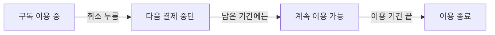

# 예상 동작: 끝난 작업 살펴보기

이 내용은 설명 방식의 예시이며 실제 앱을 검사한 결과가 아닙니다.

먼저 평소처럼 요청합니다.

> 구독 취소 기능을 추가해줘.

Showwork는 켜지지 않습니다. 작업이 끝난 뒤 결과를 보고 싶을 때 입력합니다.

> $showwork 방금 만든 구독 취소 기능을 보여줘.

보고서는 결과부터 설명합니다.

> 이제 구독을 취소하면 다음 결제가 멈춰요. 남은 이용 기간에는 계속 쓸 수 있어요.

실제 취소 화면이 있다면 캡처를 보여주고, 아래처럼 동작을 설명합니다. 코드와 확인한 자료에 맞는 내용만 넣습니다.

확인한 내용과 남은 문제를 따로 적습니다. 예를 들어 같은 취소 버튼을 두 번 눌러도 문제가 없는지 확인했다면 그 결과를 설명합니다. 실제 결제 연결을 시험하지 못했다면 그 점은 바로 보이게 남깁니다. 테스트용 흉내 화면을 실제 결제 증거라고 말하지 않습니다.

파일 위치와 검사 명령은 ‘자세히 보기’에 넣습니다. 채팅에는 짧은 결과와 브라우저 링크만 남깁니다. 결과 설명을 요청했다고 코드를 다시 고치거나 승인을 요구하지 않습니다.
